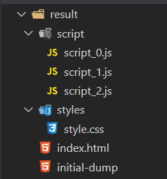

# website eater

basically i use this tool to get websites online onto my local machine
i mainly use this to get code from online site generators.

## example folder structure

## directories

pretty basic stuff actually

- `script` stores all the javascript
- `styles` stores all the css stylesheets
- `initial-dump` is the initial body of the website
- `index.html` is the final form with links to scripts and styles on ur machine

>*gg it was a fun project*
